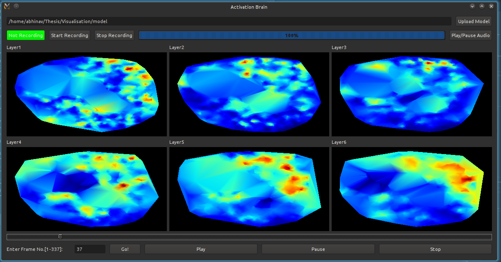

DNN-Activation-Brain
===========================

Deep Neural Network (DNN) is a powerful machine learning model with successful application in a wide range of pattern classification tasks. Despite its superior performance in handling complex real-world problems, DNNs have been used pretty much as a black box, without offering much insights in terms of how and why high quality classification performance has been achieved. We will demonstrate a novel DNN interpretation technique, where the activity patterns are used to project the hidden units of the DNN onto a meaningful 2-dimensional hidden activity space using the t-distribution Stochastic Neighbour Embedding (t-SNE). Hidden units with similar activity patterns are placed closer to one another in this space and interpretable regions can be constructed to with respect to the phone attribute. Hidden units within a specific phone region have a higher probability of being active with respect to that phone. The projected points are displayed with colours to reflect the activation values for the purpose of visualisation. This demo will showcase a DNN visualisation tool that can be used to display the changes in the activity pattern over time for all the hidden units in different hidden layers.

Currently, it takes a trained model in Kaldi as input and records an audio which is fed as input to the DNN model. It extracts MFCC features from the recorded audio and does LDA for dimensionality reduction. The hidden activations for each DNN layer are then displayed using an interatcive GUI animating over each frame of the audio. Here's a snapshot of the application:



Libraries required (for Linux)
--------------------------------
Run the following commands on Debian/Ubuntu systems (Package name same in other distros):
```
sudo apt-get install python python-numpy python-scipy python-matplotlib python-pip python-opengl python-qt4*
python pip -m install pyaudio
```

For installing Kaldi, run the following commands:
```
git clone https://github.com/backpropper/kaldi.git kaldi
cd kaldi/tools/; make; cd ../src; ./configure; make
```
Files
---------
- `deepbrain.py`: Main python application file
- `getact.sh`: bash file to get activations from the Kaldi model. Called automatically by the application.
- `activities` & `activities.realtime`: sample activations of previously recorded wav files (can be used instead of recording live audio or if Kaldi is not installed)
- `layers`: text file containing the number of layers to display in the application
- `lda`: folder containing `vertices` and `indices` file for each of the layers
- `vertices`: a 2048 x 2 matrix (each row is a 2D coordinate for each hidden unit computed using t-SNE plots)
- `indices`: a 4069 x 3 matrix (each row is a tuple containing indices to the vertices that form a triangle computed after Delaunay Triangulation)
- other files in the model folder are DNN model files used for feature transformation and storing the Deep Neural Network parameters.

How to run
------------
- Run `python deepbrain.py`.
- After the window opens, select `Upload Model` and choose the directory where the folder `lda` which contains `vertices` and `indices` of all the layers is present along with the other DNN model files (here it is the "model" directory).
- Then select `Start Recording` to start recording the live audio sample (or upload a pre-recorded wav file). Select `Stop Recording` to stop the recording and then the GUI will appear. This step might take some time to render the graphics depending upon the model size and the length of the recorded audio.
- You can also record another audio sample by clicking the `Start Recording` button again. This will refresh the GUI to display the activations of the newly recorded audio sample.

Citation
------------------
If you find the resources in this repository useful, please consider citing:
```
@incollection{gupta16demo,
    title = {Dissecting the DNN Brain for a Better Insight},
    booktitle = {IEEE International Conference on Acoustics, Speech and Signal Processing},
    author = {Abhinav Gupta and Khe Chai Sim},
    note = {Show \& Tell Demonstrations}
    year = 2016,
}
```
